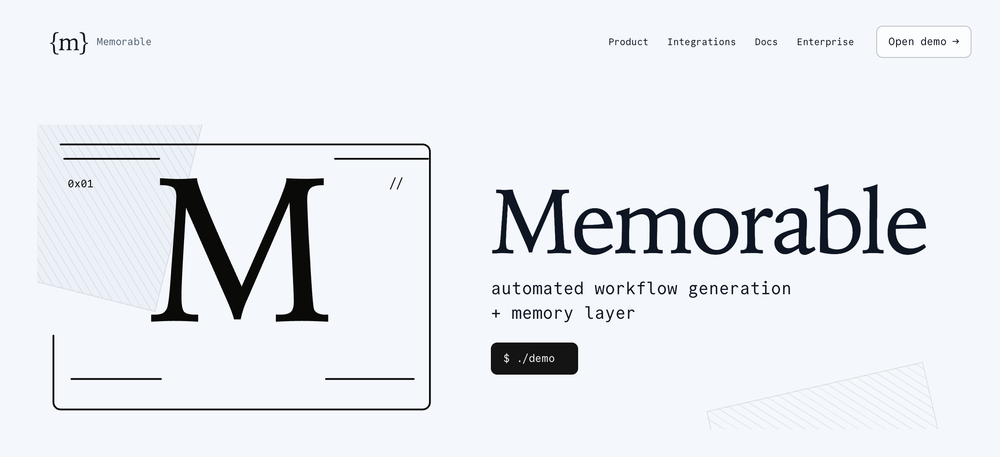
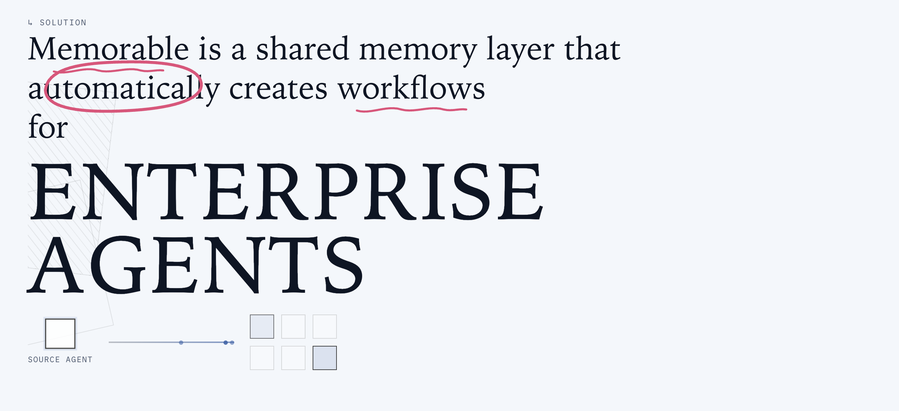
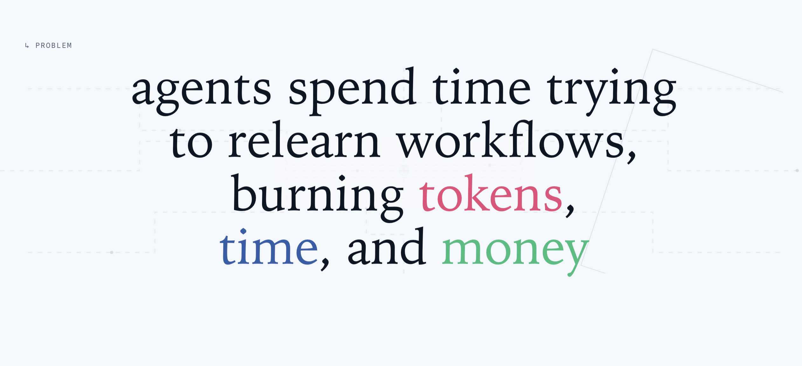
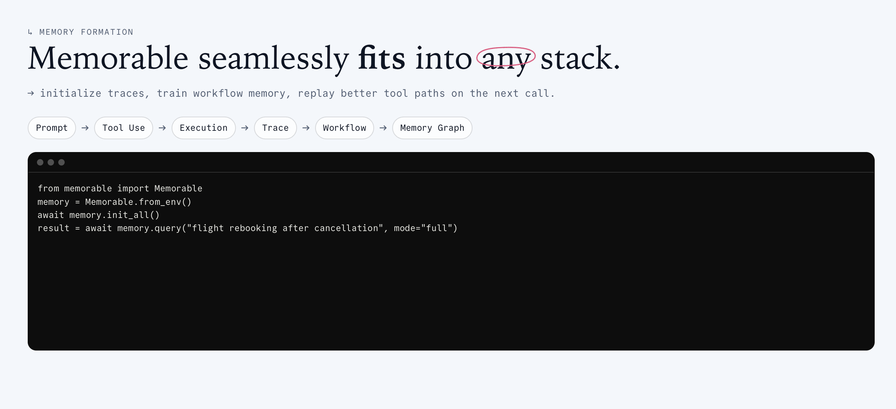
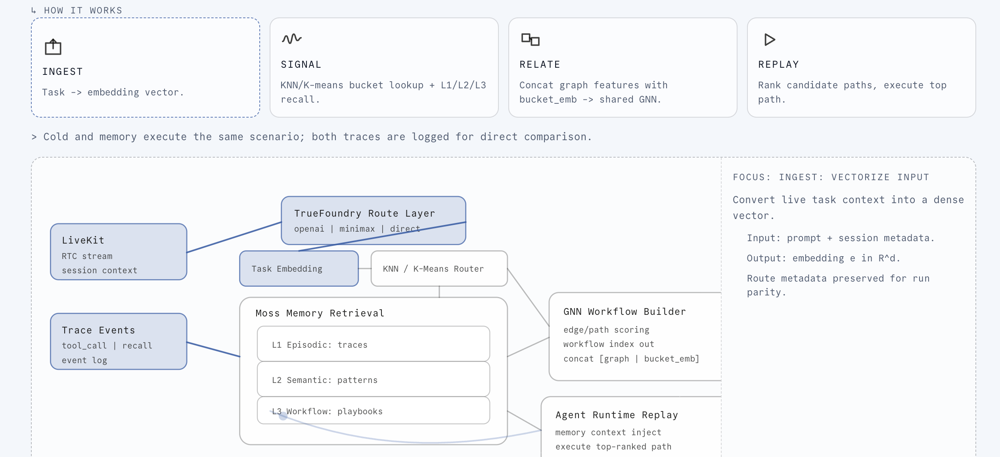
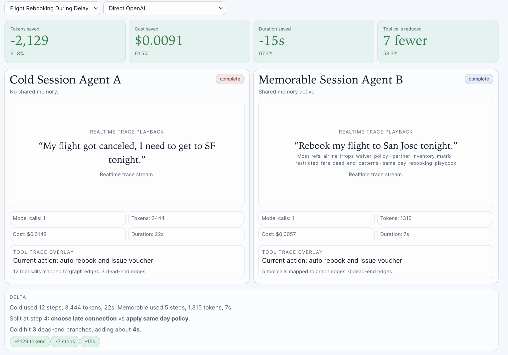
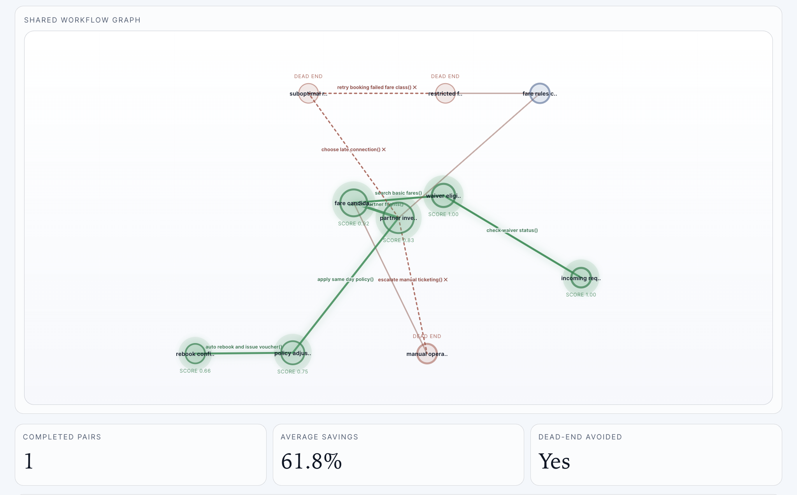

# Memorable

Live demo: https://memorable-pi.vercel.app

## Shared memory infrastructure for AI agents.

Memorable is a self-adapting memory layer for enterprise voice agents. Instead of starting every call from scratch, agents warm-start from workflows that already worked — cutting token usage, reducing errors, and resolving customer issues faster.

## How it works

Every agent run produces a tool trace: the sequence of API calls, decisions, and outcomes that led to a resolution (or didn’t). Memorable captures these traces and trains a graph neural network over them, extracting reusable workflow structures across thousands of runs. When a new agent encounters a similar task, it retrieves a proven strategy before falling back to blind exploration.

Three memory layers make this possible:

- Episodic — raw interaction traces with full provenance from individual runs
- Semantic — embeddings and similarity structure extracted across many runs via Moss
- Workflow — compressed execution graphs that agents can invoke directly

## Benchmarks

On a standardized airline cancellation prompt, a cold-start agent retries restricted-fare dead ends and eventually escalates. An agent with Memorable’s memory retrieves a learned waiver -> partner-flight -> same-day-policy workflow and resolves in a single pass — fewer steps, lower token cost, faster completion.

## Stack

- LiveKit — voice runtime
- Moss — retrieval and embeddings
- TrueFoundry — model-agnostic routing
- MiniMax — primary routed model

**Memorable is a shared memory network for enterprise agents.**

It captures successful traces, learns reusable workflows, and replays higher-quality paths on future runs.

Built for the **YC Conversational AI Hackathon 2026**.

## What the demo proves

The `/demo` page runs the same flight-rebooking scenario in two modes:

- **Cold Session Agent A**: no shared memory, explores more branches and dead ends.
- **Memorable Session Agent B**: reuses memory (Moss retrieval + workflow replay) to avoid dead ends.

The result is shown with side-by-side traces, deltas, and a shared workflow graph.

## Website walkthrough (in order)

### 1) Hero

Product identity, thesis, and entry CTA.



### 2) Problem

Why agents waste tokens, time, and money without shared memory.


### 3) Solution

Shared memory layer for enterprise agents with visual propagation.



### 4) How It Works

Pipeline from task embedding to KNN/K-means routing, Moss 3-layer retrieval, and shared GNN replay.



### 5) Memory Formation

End-to-end flow from prompt/tool execution to trace/workflow/memory graph.



### 6) Developer Experience

Build path for engineers with SDK/API and terminal-driven setup flow.



## Demo walkthrough

### 7) Shared Workflow Graph

Single state-space graph showing explored dead ends vs selected memory path.



### 8) Side-by-side run comparison

Top-line savings and direct cold-vs-memory trace comparison.



## Sponsor stack

- **LiveKit**: voice/RTC runtime and session context.
- **Moss**: memory retrieval and embedding-backed indexes.
- **TrueFoundry**: model routing layer.
- **MiniMax**: routed inference model option.

## 3-command quick start

```bash
pnpm setup
pnpm memorable:init
pnpm dev:all
```

Open:

- `http://localhost:3000` (landing)
- `http://localhost:3000/demo` (benchmark)

## Environment

```bash
cp .env.example .env.local
cp apps/web/.env.example apps/web/.env.local
```

Required variables:

```env
LIVEKIT_URL=
LIVEKIT_API_KEY=
LIVEKIT_API_SECRET=
AGENT_NAME=memorable-agent

MOSS_PROJECT_ID=
MOSS_PROJECT_KEY=
MOSS_INDEX_NAME=knowledge
MOSS_MEMORY_INDEX_NAME=memory

MEMORABLE_EVENTS_URL=http://localhost:3000/api/events/publish

TRUEFOUNDRY_ENDPOINT=
TRUEFOUNDRY_API_KEY=
TRUEFOUNDRY_MINIMAX_MODEL=MiniMax-Text-01
```

Optional for public demo token route:

```env
ALLOW_PUBLIC_DEMO=true
```

## Minimal integration

```python
from memorable import Memorable
from memorable.livekit import attach

memory = Memorable.from_env()
await memory.ensure_loaded()
attach(agent, memory, mode="full")
```

## Repo layout

- `apps/web`: Next.js landing, demo UI, and API routes.
- `worker/agent.py`: LiveKit agent runtime + tool execution.
- `packages/memorable`: Python SDK (trace ingestion, retrieval, workflow replay).
- `data/knowledge_base.json`: domain knowledge used by retrieval.

## Key APIs

- `POST /api/token`
- `POST /api/benchmark/start`
- `POST /api/benchmark/backup`
- `GET /api/events`
- `GET /api/integrations/status`
