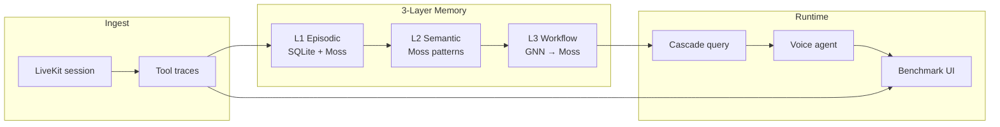

# Memorable

**Self-adapting memory for enterprise voice agents.**

Memorable gives LiveKit voice agents institutional memory — so they stop repeating mistakes (factory resets that fail, skipped outage checks) and start reusing what actually worked on past calls.

Built for the [YC Conversational AI Hackathon 2026](https://events.ycombinator.com/conversational-ai-hackathon-2026).

| Component | Role |
|-----------|------|
| **LiveKit** | Real-time voice transport, STT/TTS, agent dispatch |
| **Moss** | Semantic retrieval across knowledge, traces, and workflow indexes |
| **Memorable** | Trace store → pattern extraction → GNN playbooks → runtime injection |
| **TrueFoundry** *(optional)* | LLM gateway routing (OpenAI, MiniMax, etc.) |

---

## The problem

Enterprise support agents forget everything between calls. A cold agent with only static docs will:

- Skip outage checks and jump to destructive resets
- Repeat tool sequences that failed dozens of times before
- Burn tokens re-discovering the same diagnosis path

Memorable closes the loop: **every tool call becomes a trace**, patterns aggregate into semantic memory, and a GNN distills compact playbooks that change runtime behavior.

---

## How it works



### Memory layers

| Layer | Storage | What it captures |
|-------|---------|------------------|
| **L1 Episodic** | SQLite (`data/memorable.db`) + Moss `memory` index | Raw tool-call sequences per session with outcomes |
| **L2 Semantic** | Moss `memory` index | Aggregated patterns — e.g. *"factory reset failed 5×, modem reboot succeeded 8×"* |
| **L3 Workflow** | PyTorch Geometric GNN → Moss `workflows` index | Distilled playbooks with RECOMMENDED / AVOID tool lists |

### Cold vs memory modes

Each call is tagged with `memory_mode` in LiveKit dispatch metadata:

| Mode | Retrieval | Behavior |
|------|-----------|----------|
| **`cold`** | Knowledge docs only (Moss `knowledge` index) | No workflow/semantic/episodic — agent follows generic documentation |
| **`full`** | Full 3-layer cascade | Workflow-first; `avoid_tools` blocks known dead ends |

The benchmark console runs both modes side-by-side on the same scenario so you can see memory change the tool path, cost, and outcome.

---

## Demo

### Live benchmark console

Open [http://localhost:3000/demo](http://localhost:3000/demo) after starting the stack.

1. Pick a **scenario** (internet dropout, billing dispute, or phone service)
2. Start a **benchmark run** — this stamps a `run_id` into session metadata
3. Run **Call 1 (cold)** — say the scenario prompt aloud or type it
4. Run **Call 2 (memory)** — same prompt, memory cascade active
5. Review the **comparison** — tool sequences, token estimates, avoided dead ends, event log

### Scenarios and expected divergence

#### Internet dropout
**Prompt:** *"My internet keeps dropping"*

| | Cold | Memory |
|---|------|--------|
| **Path** | Speed test → factory reset | Outage check → line signal → modem reboot |
| **Outage check** | Skipped | First step (zip 95014 on demo account) |
| **Factory reset** | Attempted (fails) | Blocked by memory |

#### Billing dispute
**Prompt:** *"I was overcharged this month"*

| | Cold | Memory |
|---|------|--------|
| **Path** | Escalate to tier-2 | Pull billing → apply credit |
| **Resolution** | Slow handoff | Direct credit on account |

#### Phone service issue
**Prompt:** *"Calls keep failing"*

| | Cold | Memory |
|---|------|--------|
| **Path** | Factory reset router | Reset APN → reboot modem |
| **Factory reset** | Attempted (fails) | Avoided |

### Landing page

[http://localhost:3000](http://localhost:3000) — product overview, pipeline explainer, integration status, and link to the demo.

---

## Quick start (local, ~5 minutes)

### Prerequisites

- **Node.js** ≥ 22, **pnpm** ≥ 10
- **Python** 3.10–3.14, **[uv](https://docs.astral.sh/uv/)**
- **LiveKit Cloud** project ([cloud.livekit.io](https://cloud.livekit.io)) with API key/secret
- **Moss** project ([moss.dev](https://docs.moss.dev/docs)) with project ID + key

### 1. Clone and install

```bash
git clone <your-repo-url> memorable.build
cd memorable.build
pnpm setup
```

`pnpm setup` runs: root pnpm install → `apps/web` install → `uv sync` → copies env template if missing.

### 2. Configure environment

Create **`apps/web/.env.local`** (and optionally a root **`.env.local`** for the Python worker — both are loaded):

```bash
cp .env.example .env.local
cp apps/web/.env.example apps/web/.env.local
# Edit both files with your keys
```

Minimum required variables:

```env
# LiveKit — required for voice demo
LIVEKIT_URL=wss://<project>.livekit.cloud
LIVEKIT_API_KEY=<key>
LIVEKIT_API_SECRET=<secret>
AGENT_NAME=memorable-agent

# Moss — required for memory init and cascade
MOSS_PROJECT_ID=<id>
MOSS_PROJECT_KEY=<key>
MOSS_INDEX_NAME=knowledge
MOSS_MEMORY_INDEX_NAME=memory

# Worker → web event bridge (default works locally)
MEMORABLE_EVENTS_URL=http://localhost:3000/api/events/publish
```

Optional:

```env
# TrueFoundry AI Gateway
TRUEFOUNDRY_API_KEY=
TRUEFOUNDRY_ENDPOINT=https://llm-gateway.truefoundry.com/api/inference/openai
```

> **Note:** `/api/token` currently only mints tokens when `NODE_ENV=development`. For Vercel/preview deploys, remove or gate that check (e.g. behind auth or a `ALLOW_PUBLIC_DEMO` flag) before going live.

### 3. Initialize memory

Seeds ~21 demo traces, indexes the knowledge base, trains the GNN, and exports workflows to Moss:

```bash
pnpm memorable:init
```

This is idempotent — safe to re-run.

### 4. Download LiveKit agent model files (first run only)

```bash
pnpm worker:download-files
```

### 5. Start web + worker

```bash
pnpm dev:all
```

| Service | URL / process |
|---------|----------------|
| Web app | [http://localhost:3000](http://localhost:3000) |
| Demo | [http://localhost:3000/demo](http://localhost:3000/demo) |
| LiveKit worker | `memorable-agent` (background process) |

---

## Integrate into your agent

Five lines to attach Memorable to any LiveKit Python agent:

```python
from memorable import Memorable
from memorable.livekit import attach

memory = Memorable.from_env()
await memory.ensure_loaded()
hook = attach(agent, memory, mode="full")  # or mode="cold"
```

### Room metadata

The web app stamps dispatch metadata when minting tokens:

```json
{
  "user_id": "<uuid>",
  "memory_mode": "cold" | "full",
  "scenario_id": "internet_dropout" | "billing_dispute" | "phone_service_issue",
  "run_id": "<benchmark-run-id>",
  "model_route": "direct-openai" | "truefoundry-openai" | "truefoundry-minimax"
}
```

The worker reads `memory_mode` and `scenario_id` to select the playbook and cascade mode.

### Recording traces after a call

```python
# On session end — writes L1 trace and updates workflow edges
hook.finalize(outcome="success")  # or "failure"
```

Re-run `pnpm memorable:init` (or call `memory.init_all()`) to re-index patterns and retrain the GNN after new traces accumulate.

---

## Project structure

```
memorable.build/
├── apps/web/                 Next.js 15 app
│   ├── app/                  Routes: /, /demo, /api/*
│   ├── components/
│   │   ├── demo/             Benchmark console (cold vs memory)
│   │   └── landing/          Marketing / pipeline page
│   └── lib/                  Benchmark store, types, utilities
│
├── packages/memorable/       Python SDK (pip install -e .)
│   └── memorable/
│       ├── client.py         Memorable.from_env(), init_all(), query()
│       ├── memory/           Cascade, traces, semantic, tools
│       ├── gnn/              Graph builder + PyG trainer
│       ├── moss/             Moss client + index setup
│       └── livekit/          MemoryHook, attach(), briefings
│
├── worker/                   LiveKit agent worker
│   └── agent.py              SupportAgent + tool stubs + event publish
│
├── data/
│   ├── knowledge_base.json   13 ISP support articles (indexed to Moss)
│   ├── memorable.db          Created by init (SQLite traces)
│   └── gnn_model.pt          Created by init (GNN weights)
│
├── docs/
│   └── PITCH.md              30-second presenter script
│
└── agent-py/                 Legacy v1 reference (env preserved)
```

---

## Available tools (demo stubs)

The worker implements simulated ISP support tools. Results are deterministic so the benchmark is reproducible.

| Tool | Simulated result |
|------|------------------|
| `check_outage_map` | No outages near zip 95014 |
| `check_line_signal` | Signal weak at −18 dBm |
| `reboot_modem` | Modem reboot sent |
| `factory_reset_router` | **Fails** — router does not come back |
| `run_speed_test` | 45/12 Mbps |
| `pull_account_billing` | Overcharge confirmed |
| `apply_bill_credit` | $25 credit applied |
| `escalate_tier2` | Tier-2 queue (slow) |
| `reset_apn_settings` | APN profile refreshed |

Backend tools run **before the agent speaks** on the first scenario-triggering turn. The UI sidebar shows each step with outcome (ok / failed) and a short summary.

---

## API reference

### Web — voice & events

| Endpoint | Method | Description |
|----------|--------|-------------|
| `/api/token` | POST | Mint LiveKit room token + agent dispatch metadata |
| `/api/events` | GET | SSE stream of worker events (`tool_call`, `memory_injection`, …) |
| `/api/events/publish` | POST | Worker webhook target for event ingestion |
| `/api/init` | POST | Run `memorable.client` init (seed + GNN + Moss) |
| `/api/memory/status` | GET | Layer status, metrics, trace count |
| `/api/memory/graph?task=` | GET | GNN workflow graph for a task type |
| `/api/integrations/status` | GET | Which integrations are configured |

### Benchmark

| Endpoint | Method | Description |
|----------|--------|-------------|
| `/api/benchmark/start` | POST | Create a new benchmark run (`scenario_id`) |
| `/api/benchmark/reset` | POST | Clear in-memory benchmark history |
| `/api/benchmark/runs` | GET | List recent runs + aggregate stats |
| `/api/benchmark/runs/:id` | GET | Full event trace for a run |
| `/api/benchmark/backup` | POST | Generate a fallback replay run for demos |

### SSE event types

| Event | Payload highlights |
|-------|-------------------|
| `session_start` | `session_id`, `mode` |
| `memory_injection` | `layer`, `layers_active`, `next_action`, `avoid_tools`, `elapsed_ms` |
| `tool_call` | `tool`, `steps[]`, `outcome`, `summary` |
| `tool_blocked` | `tool`, `reason` |
| `session_end` | `steps[]`, final stats |

Events are delivered via **SSE** (`/api/events`) and **LiveKit data channel** (fallback when SSE is blocked).

---

## Deployment

Memorable splits into two deploy targets:

| Part | Where to deploy | Notes |
|------|-----------------|-------|
| **Web app** (`apps/web`) | [Vercel](https://vercel.com) | Landing, demo UI, token API, SSE, benchmark |
| **LiveKit worker** (`worker/`) | LiveKit Cloud agent hosting, Railway, Fly.io, etc. | Must stay running for voice calls |

### Deploy web to Vercel

1. Push this repo to GitHub
2. Import the project in Vercel
3. Set **Root Directory** to `apps/web`
4. Add environment variables (same as `.env.local`)
5. **Update `/api/token`** — remove or replace the development-only guard so tokens can be minted on the deployed domain (add auth for anything beyond hackathon demos)
6. Deploy

Build settings (usually auto-detected):

- **Framework:** Next.js
- **Install:** `pnpm install`
- **Build:** `pnpm build`

### Point the worker at production

On whatever hosts the worker, set:

```env
MEMORABLE_EVENTS_URL=https://<your-vercel-domain>/api/events/publish
LIVEKIT_URL=...
LIVEKIT_API_KEY=...
LIVEKIT_API_SECRET=...
MOSS_PROJECT_ID=...
MOSS_PROJECT_KEY=...
AGENT_NAME=memorable-agent
```

Then run:

```bash
uv --directory worker run agent.py start
```

### What works on Vercel vs locally

| Feature | Local | Vercel |
|---------|-------|--------|
| Landing page | ✅ | ✅ |
| Benchmark UI + SSE | ✅ | ✅ |
| LiveKit token minting | ✅ | ⚠️ Requires removing dev-only guard in `/api/token` |
| Voice calls | ✅ (worker local) | ✅ (worker deployed separately) |
| `/api/init` (Python init) | ✅ | ❌ — run init locally or in CI, commit `data/memorable.db` |
| `/api/memory/graph` | ✅ | ❌ — no Python runtime on Vercel serverless |

For production demos, pre-run `pnpm memorable:init` locally and commit the generated `data/memorable.db` + `data/gnn_model.pt`, or run init in a CI step before deploy.

---

## Development commands

```bash
pnpm dev:all          # Web (:3000) + worker concurrently
pnpm dev:web          # Next.js only
pnpm dev:worker       # LiveKit agent only
pnpm build            # Production build (apps/web)
pnpm memorable:init   # Seed traces, index Moss, train GNN
pnpm worker:download-files
pnpm lint             # ESLint (apps/web)
pnpm test             # pytest (packages/memorable)
```

### Python SDK directly

```bash
uv run --directory packages/memorable python -m memorable.client   # init_all()
uv run --directory packages/memorable pytest
```

### Install SDK in another project

```bash
pip install -e packages/memorable
# or
uv add --path packages/memorable memorable
```

---

## Seed data

`pnpm memorable:init` seeds idempotent demo traces:

| Task type | Success traces | Failure traces | Learned pattern |
|-----------|---------------|----------------|-----------------|
| `internet_dropout` | 8 | 5 | Outage → signal → reboot; avoid factory reset |
| `billing_dispute` | 2 | 1 | Pull billing → credit; avoid blind escalation |
| `phone_service_issue` | 2 | 1 | APN reset → reboot; avoid factory reset |
| `sim_activation` | 2 | — | activate_sim |

Knowledge base: **13 articles** in `data/knowledge_base.json` covering internet, billing, phone, SIM, and general ISP support flows.

---

## Troubleshooting

### Voice connects but no tools appear in sidebar

- Confirm the worker is running (`pnpm dev:worker`)
- Check `MEMORABLE_EVENTS_URL` points to your web app
- Restart both processes after env changes
- Say the full scenario prompt (e.g. *"my internet keeps dropping"*)

### Agent speaks but sidebar stays empty

- Hard refresh the demo page
- Check browser devtools → Network → `/api/events` SSE connection is open
- Look for `Event publish failed` warnings in worker logs

### `pnpm memorable:init` fails

- Verify `MOSS_PROJECT_ID` and `MOSS_PROJECT_KEY` are set
- Ensure Moss project has capacity for three indexes: `knowledge`, `memory`, `workflows`

### Worker import errors

```bash
uv sync
uv run --directory worker python -c "import agent"
```

### Token route returns 500 on Vercel

The token route throws outside `NODE_ENV=development`. For deployed demos, update `apps/web/app/api/token/route.ts` to allow production token minting (ideally behind authentication).

### Cold and memory look identical

- Confirm Call 1 metadata has `memory_mode: "cold"` and Call 2 has `"full"` (check network tab on `/api/token` response flow)
- Re-run `pnpm memorable:init` so Moss workflow indexes are populated
- Check the benchmark event log for `memory_injection` layer = `workflow` on memory calls

---

## Architecture decisions

- **Moss for retrieval, SQLite for source of truth** — traces live in SQLite; Moss indexes are rebuilt from SQLite on init
- **GNN exports to Moss workflows** — runtime cascade queries Moss, not the GNN directly, keeping inference fast at call time
- **Playbooks per scenario** — demo reliability: memory and cold paths are scenario-specific and visibly different
- **Events dual-published** — SSE + LiveKit data channel so the UI works even when one transport fails
- **Batch tool execution** — on the first scenario trigger, all playbook steps run before the agent speaks, so judges see the full path immediately

---

## Sponsors & stack

LiveKit · Moss · TrueFoundry · MiniMax · Unsiloed AI

---

## License

See repository license. Built on the [LiveKit + Moss hackathon starter](https://github.com/livekit-examples/moss-hacker-starter).

---

## Further reading

- [docs/PITCH.md](docs/PITCH.md) — 30-second presenter script
- [LiveKit Agents docs](https://docs.livekit.io/agents/)
- [Moss documentation](https://docs.moss.dev/docs)
